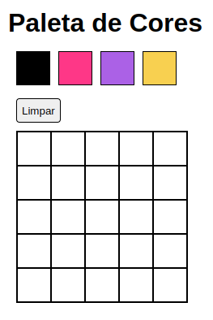

# Projeto Arte com Pixels

Projeto desenvolvido durante o curso da Trybe para fixação de aprendizados. O objetivo é implementar uma tela que contém uma paleta de cores funcional que poderá ser utilizada para formar desenhos em pixels. É possivel clicar no pixel da cor e atribuir ela a um dos pixels da tabela. A página contém um botão para excluir o desenho que está feito. 

Foi praticado HTML, CSS e Javascript com a manipulação do DOM.

